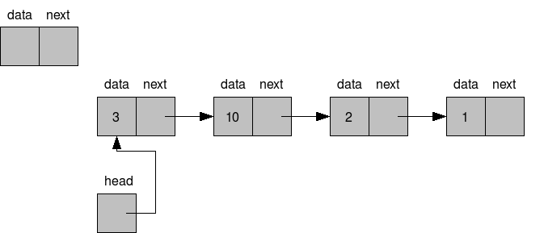
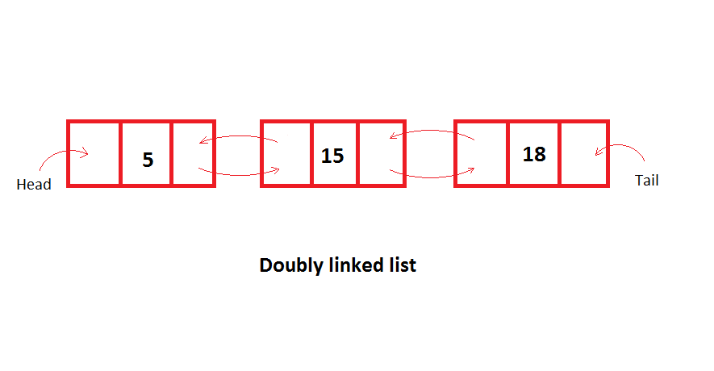
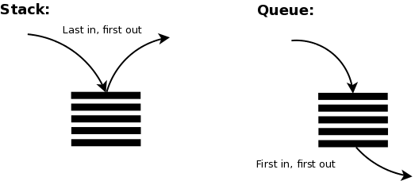
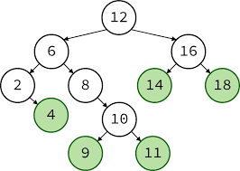

# DSA
# Data Structures - Linked Lists

This repository contains implementations of fundamental data structures in Python, specifically the **Binary Search Tree (BST)** along with previous implementations of **Queue**, **Stack**, **Singly Linked List**, and **Doubly Linked List**.

## Files

- `SinglyLinkedList.py`: Contains the implementation of a singly linked list (SLL), where each node points to the next node in the sequence.
- `DoublyLinkedList.py`: Contains the implementation of a doubly linked list (DLL), where each node has pointers to both the next and previous nodes.
- `Stack.py`: Contains the implementation of a stack, which follows the Last-In-First-Out (LIFO) principle.
- `Queue.py`: Contains the implementation of a queue, which follows the First-In-First-Out (FIFO) principle.
- `BST.py`: Contains the implementation of a binary search tree, allowing efficient insertion, deletion, and search operations based on the properties of a binary tree.

## Features

### Singly Linked List (SLL)
- **File**: `SinglyLinkedList.py`
- **Description**: Implements a singly linked list with basic operations: Insert at start pos, end pos and desired pos; Deletion at start pos, end pos and desried pos; Traversal .

### Doubly Linked List (DLL)
- **File**: `DoublyLinkedList.py`
- **Description**: Implements a doubly linked list with enhanced functionality, having following operations: Insert at start pos, end pos and desired pos; Deletion at start pos, end pos and desried pos; Traversal from both pos .

### Stack
- **File**: `Stack.py`
- **Description**: Implements a stack data structure with basic operations like `push`, `pop`, and `peek`. The stack operates on a Last-In-First-Out (LIFO) basis.

### Queue
- **File**: `Queue.py`
- **Description**: Implements a queue data structure with basic operations like `enqueue`, `dequeue`, and `peek`. The queue operates on a First-In-First-Out (FIFO) basis.

### Binary Search Tree (BST)
- **File**: `BST.py`
- **Description**: Implements a binary search tree (BST) data structure with basic operations like `insert`, `delete`, and `search`. In a BST, each node has a maximum of two children, with the left child containing values less than the parent node and the right child containing values greater than the parent node.

#### Tree Traversal Methods
Traversal methods are essential for accessing the elements of a tree in a specific order. Here are three common traversal methods implemented in the BST:

- **In-Order Traversal**: 
  - Visits nodes in ascending order for a binary search tree.
  - **Order**: Left subtree → Root → Right subtree.
  - **Use Case**: Produces a sorted list of elements from the tree.

- **Pre-Order Traversal**: 
  - Visits the root before its subtrees.
  - **Order**: Root → Left subtree → Right subtree.
  - **Use Case**: Used to create a copy of the tree or to serialize the tree structure.

- **Post-Order Traversal**: 
  - Visits the root after its subtrees.
  - **Order**: Left subtree → Right subtree → Root.
  - **Use Case**: Useful for deleting nodes or evaluating expression trees.

## Usage

Clone the repository and run the files in a Python environment to interact with the linked list implementations. Each file contains methods to initialize, insert, delete, and traverse the lists.

